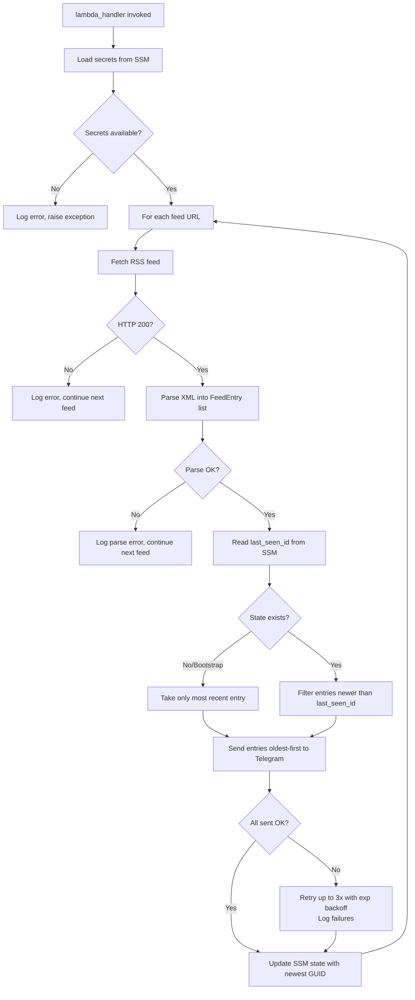

# Design Document: AWS News Telegram Notifier

## Overview

The AWS News Telegram Notifier is a serverless system that polls the AWS What's New RSS feed on a schedule, detects new entries, and forwards them as formatted messages to a Telegram channel. It is built entirely on AWS using a Lambda function triggered by EventBridge, with SSM Parameter Store for both state tracking and secrets management. All infrastructure is provisioned via Terraform.

The system is designed for the RS School DevOps 2025 learning project and targets the `eu-west-1` region by default.

### Key Design Decisions

- **SSM Parameter Store over Secrets Manager** for secrets: sufficient security for a learning project, lower cost, and simpler IAM policy surface.
- **SSM Parameter Store for state** (last-seen GUID): avoids DynamoDB overhead for a single string value per feed.
- **SQS Dead Letter Queue** attached to the Lambda event source to capture failed invocations without data loss.
- **Python runtime** for Lambda: rich RSS parsing ecosystem (`feedparser`) and concise Telegram HTTP calls.
- **Bootstrap behaviour on first run**: send only the most recent entry to avoid flooding the channel on initial deployment.

---

## Architecture

```mermaid
flowchart TD
    EB[EventBridge Scheduled Rule\nevery 60 min] -->|invoke| LF[Lambda Function\naws-news-notifier]
    LF -->|read secrets| SSM_S[SSM Parameter Store\n/notifier/telegram/bot_token\n/notifier/telegram/chat_id]
    LF -->|read/write state| SSM_ST[SSM Parameter Store\n/notifier/state/{feed_hash}]
    LF -->|fetch RSS| RSS[AWS What's New\nRSS Feed]
    LF -->|sendMessage| TG[Telegram Bot API]
    LF -->|logs| CW[CloudWatch Logs]
    LF -->|on failure| DLQ[SQS Dead Letter Queue]

    style EB fill:#FF9900,color:#fff
    style LF fill:#FF9900,color:#fff
    style SSM_S fill:#3F8624,color:#fff
    style SSM_ST fill:#3F8624,color:#fff
    style DLQ fill:#FF9900,color:#fff
    style CW fill:#FF9900,color:#fff
    style RSS fill:#232F3E,color:#fff
    style TG fill:#2CA5E0,color:#fff
```

### Component Responsibilities

| Component | Responsibility |
|---|---|
| EventBridge Rule | Triggers Lambda on a cron schedule |
| Lambda Function | Orchestrates polling, dedup, and notification |
| SSM (secrets) | Stores bot token and chat ID as `SecureString` |
| SSM (state) | Stores last-seen entry GUID per feed URL |
| SQS DLQ | Captures failed Lambda invocation payloads |
| CloudWatch Logs | Structured log sink for observability |

---

## Components and Interfaces

### Lambda Function

**Entry point**: `handler.lambda_handler(event, context)`

**Internal modules**:

```
lambda/
├── handler.py          # Entry point, orchestration
├── rss_parser.py       # RSS fetch and parse logic
├── state_store.py      # SSM read/write for last-seen GUID
├── secret_store.py     # SSM SecureString read for credentials
├── telegram.py         # Telegram Bot API client
└── requirements.txt    # feedparser, requests (or urllib)
```

**Execution flow**:



### SSM Parameter Store Interface

| Parameter Path | Type | Purpose |
|---|---|---|
| `/notifier/telegram/bot_token` | `SecureString` | Telegram Bot API token |
| `/notifier/telegram/chat_id` | `SecureString` | Target Telegram channel ID |
| `/notifier/state/{url_hash}` | `String` | Last-seen entry GUID for a feed URL |

`url_hash` is the MD5 hex digest of the feed URL, keeping the parameter path safe for SSM naming rules.

### Telegram Bot API Interface

- **Endpoint**: `POST https://api.telegram.org/bot{token}/sendMessage`
- **Payload**:
  ```json
  {
    "chat_id": "<chat_id>",
    "text": "📢 <title>\n\n<link>",
    "parse_mode": "HTML",
    "disable_web_page_preview": false
  }
  ```
- **Retry policy**: up to 3 attempts, backoff delays of 1s, 2s, 4s.

### EventBridge Rule

- **Schedule expression**: `rate(60 minutes)` (configurable via Terraform variable)
- **Target**: Lambda function ARN
- **Dead-letter config**: SQS queue ARN on the Lambda event source mapping

---

## Data Models

### FeedEntry

Represents a single parsed RSS item.

```python
@dataclass
class FeedEntry:
    guid: str        # Unique identifier (GUID element or link fallback)
    title: str       # Entry title
    link: str        # Entry URL
    published: str   # Publication date string (ISO 8601 or RFC 2822)
```

### FeedState

Represents the persisted state for one feed URL.

```python
@dataclass
class FeedState:
    feed_url: str       # Original feed URL
    last_seen_id: str   # GUID of the most recently processed entry
```

Stored in SSM as a plain string value (`last_seen_id` only); `feed_url` is encoded in the parameter path.

### Lambda Environment Variables

| Variable | Description | Sensitive |
|---|---|---|
| `FEED_URLS` | Comma-separated list of RSS feed URLs | No |
| `SSM_BOT_TOKEN_PATH` | SSM path for bot token | No |
| `SSM_CHAT_ID_PATH` | SSM path for chat ID | No |
| `SSM_STATE_PATH_PREFIX` | SSM path prefix for state params | No |
| `LOG_LEVEL` | Python logging level (default: `INFO`) | No |

### Terraform Variables

| Variable | Type | Default | Description |
|---|---|---|---|
| `region` | `string` | `eu-west-1` | AWS deployment region |
| `name_prefix` | `string` | `aws-news-notifier` | Prefix for all resource names |
| `feed_urls` | `string` | `https://aws.amazon.com/about-aws/whats-new/recent/feed/` | Comma-separated RSS feed URLs |
| `schedule_expression` | `string` | `rate(60 minutes)` | EventBridge schedule |
| `lambda_timeout` | `number` | `60` | Lambda timeout in seconds |
| `lambda_memory` | `number` | `128` | Lambda memory in MB |
| `dlq_retention_days` | `number` | `14` | SQS message retention in days |
| `environment` | `string` | `dev` | Environment tag value |
| `project` | `string` | `rsschool-devops-2025` | Project tag value |

### IAM Policy (Least Privilege)

The Lambda execution role is granted only:

```json
{
  "Version": "2012-10-17",
  "Statement": [
    {
      "Effect": "Allow",
      "Action": ["ssm:GetParameter"],
      "Resource": [
        "arn:aws:ssm:{region}:{account}:parameter/notifier/telegram/bot_token",
        "arn:aws:ssm:{region}:{account}:parameter/notifier/telegram/chat_id",
        "arn:aws:ssm:{region}:{account}:parameter/notifier/state/*"
      ]
    },
    {
      "Effect": "Allow",
      "Action": ["ssm:PutParameter"],
      "Resource": "arn:aws:ssm:{region}:{account}:parameter/notifier/state/*"
    },
    {
      "Effect": "Allow",
      "Action": ["kms:Decrypt"],
      "Resource": "<aws_managed_ssm_key_arn>"
    },
    {
      "Effect": "Allow",
      "Action": [
        "logs:CreateLogGroup",
        "logs:CreateLogStream",
        "logs:PutLogEvents"
      ],
      "Resource": "arn:aws:logs:{region}:{account}:log-group:/aws/lambda/*"
    },
    {
      "Effect": "Allow",
      "Action": ["sqs:SendMessage"],
      "Resource": "<dlq_arn>"
    }
  ]
}
```


---

## Correctness Properties

*A property is a characteristic or behavior that should hold true across all valid executions of a system — essentially, a formal statement about what the system should do. Properties serve as the bridge between human-readable specifications and machine-verifiable correctness guarantees.*

### Property 1: RSS Parsing Round-Trip

*For any* valid RSS XML document, parsing it into a list of `FeedEntry` objects and then reading back the `guid`, `title`, `link`, and `published` fields from those objects should produce values equivalent to those present in the original XML document.

**Validates: Requirements 7.3, 1.2**

---

### Property 2: Parsed Entries Have Required Fields

*For any* valid RSS XML document, every `FeedEntry` returned by the parser shall have non-empty `title`, `link`, and `published` fields.

**Validates: Requirements 1.5**

---

### Property 3: Feed URL Config Round-Trip

*For any* non-empty list of feed URL strings, encoding them as a comma-separated environment variable string and then parsing that string back into a list should produce a list equal to the original.

**Validates: Requirements 1.4**

---

### Property 4: State Store Round-Trip

*For any* feed URL and GUID string, writing the GUID to the state store under that feed URL's parameter path and then reading it back should return the same GUID string.

**Validates: Requirements 2.1**

---

### Property 5: New Entry Filtering

*For any* ordered list of feed entries and a `last_seen_id` that matches one of those entries, the filter function should return only the entries that appear after the entry with that `last_seen_id` in the list (i.e., newer entries only).

**Validates: Requirements 2.2**

---

### Property 6: Bootstrap Returns Single Entry

*For any* non-empty list of feed entries and a `last_seen_id` of `None`, the filter function should return exactly one entry — the most recent (first in feed order).

**Validates: Requirements 2.4** *(edge case of Property 5)*

---

### Property 7: State Updated to Most Recent Entry

*For any* non-empty list of new entries processed in a poll cycle, after the cycle completes successfully the value stored in the state store for that feed URL should equal the `guid` of the first entry in the list (most recent, since feeds are newest-first).

**Validates: Requirements 2.3**

---

### Property 8: Message Format Contains Title and Link

*For any* `FeedEntry`, the string produced by the message formatter should contain both the entry's `title` and the entry's `link` as substrings.

**Validates: Requirements 3.2, 3.1**

---

### Property 9: Entries Sent in Chronological Order

*For any* list of new feed entries, the sequence of Telegram `sendMessage` calls should be made in oldest-first order (i.e., the entry with the earliest `published` date is sent first).

**Validates: Requirements 3.5**

---

### Property 10: Structured Log Contains Required Fields

*For any* poll cycle execution, the structured log record emitted should contain the keys `feed_url`, `new_entries_count`, and `dispatch_status`.

**Validates: Requirements 6.1**

---

## Error Handling

### HTTP Fetch Errors (Requirement 1.3)

When the RSS feed URL returns a non-200 status or raises a connection error:
- Log at `ERROR` level with `feed_url` and `status_code` (or exception message)
- Skip state store update for that feed
- Continue processing remaining feed URLs
- Do not raise an unhandled exception (avoids unnecessary DLQ routing for transient network issues)

### RSS Parse Errors (Requirement 7.2)

When `feedparser` returns a malformed or empty result:
- Log at `ERROR` level with `feed_url` and parse error details
- Skip that feed for the current cycle
- Do not modify state store

### SSM / Secrets Errors (Requirement 4.3)

When SSM `GetParameter` fails for bot token or chat ID:
- Log at `ERROR` level with parameter path and exception
- Raise exception immediately — Lambda exits, EventBridge routes to DLQ
- No Telegram messages are sent

### Telegram API Errors (Requirement 3.3)

When `sendMessage` returns non-200:
- Retry up to 3 times with exponential backoff: 1s, 2s, 4s
- Log each retry attempt at `WARNING` level
- After 3 failures, log at `ERROR` level and continue to next entry
- State store is still updated with the last successfully sent entry's GUID

### Unhandled Exceptions

Any unhandled exception propagates out of `lambda_handler`, causing Lambda to mark the invocation as failed. EventBridge then routes the event payload to the SQS DLQ for inspection.

---

## Testing Strategy

### Dual Testing Approach

Both unit tests and property-based tests are required. They are complementary:
- **Unit tests** cover specific examples, integration points, and error conditions
- **Property tests** verify universal correctness across randomised inputs

### Property-Based Testing

**Library**: `hypothesis` (Python)

Each property-based test runs a minimum of 100 iterations. Tests are tagged with a comment referencing the design property they validate.

Tag format: `# Feature: aws-news-telegram-notifier, Property {N}: {property_text}`

| Design Property | Test Description |
|---|---|
| Property 1 | Generate random RSS XML docs, parse, verify field round-trip |
| Property 2 | Generate random RSS XML docs, assert all entries have non-empty title/link/published |
| Property 3 | Generate random URL lists, encode to CSV, parse back, assert equality |
| Property 4 | Generate random (url, guid) pairs, write to mock SSM, read back, assert equality |
| Property 5 | Generate random entry lists with random last_seen_id, assert filter returns only newer entries |
| Property 6 | Generate random non-empty entry lists, filter with None last_seen_id, assert exactly 1 entry returned |
| Property 7 | Generate random entry lists, simulate successful dispatch, assert stored GUID equals first entry's GUID |
| Property 8 | Generate random FeedEntry instances, format message, assert title and link are substrings |
| Property 9 | Generate random lists of FeedEntry with varied published dates, assert send order is oldest-first |
| Property 10 | Generate random poll cycle inputs, capture log output, assert required keys present |

### Unit Tests

Unit tests focus on:
- **Specific examples**: known RSS XML snippets with expected parsed output
- **Error conditions**: HTTP 4xx/5xx responses, malformed XML, SSM exceptions, Telegram API failures
- **Retry logic**: verify exactly 3 retry attempts with correct backoff delays using `unittest.mock`
- **Bootstrap behaviour**: first-run with no existing state returns exactly one entry
- **Integration smoke test**: mock all AWS and Telegram calls, invoke `lambda_handler`, assert correct SSM writes and Telegram calls

### Test Structure

```
lambda/
└── tests/
    ├── test_rss_parser.py       # Unit + property tests for rss_parser.py
    ├── test_state_store.py      # Unit + property tests for state_store.py
    ├── test_telegram.py         # Unit + property tests for telegram.py
    ├── test_handler.py          # Integration unit tests for handler.py
    └── conftest.py              # Shared fixtures and Hypothesis strategies
```

### Terraform Testing

- Run `terraform validate` and `terraform plan` in CI to catch configuration errors
- Verify resource tagging by inspecting the plan output for `project` and `environment` tags
